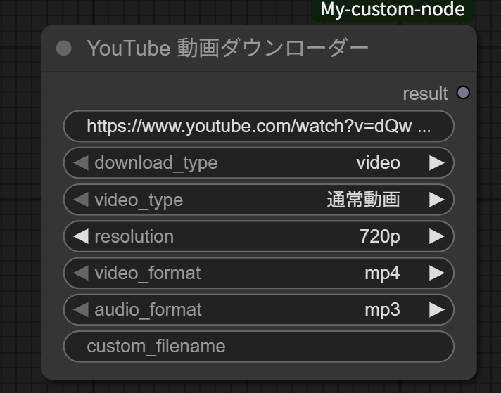

# ComfyUI YouTube Downloader Node

[](https://opensource.org/licenses/MIT)
[](https://www.python.org/downloads/)

A custom ComfyUI node for downloading YouTube videos and audio with precise resolution control.


## Preview



*The YouTube Downloader node interface in ComfyUI*

## Features

- **Video Download**: Download YouTube videos in MP4, WebM, or MKV format
- **Audio Extraction**: Extract audio in MP3, M4A, OPUS, or WAV format
- **Resolution Control**: Choose from 1080p, 720p, 480p, or 360p
- **Video Type Support**: Normal videos (landscape) or Short videos (portrait)
- **Auto Size Conversion**: Automatically handles portrait/landscape orientation
- **Standalone Operation**: Works independently without connecting to other nodes

## Installation

### Method 1: Git Clone (Recommended)

```bash
cd ComfyUI/custom_nodes/
git clone https://github.com/YOUR_USERNAME/comfyui-youtube-downloader.git
```

### Method 2: Manual Download

1. Download this repository as ZIP
2. Extract to your ComfyUI custom nodes directory:
   ```
   ComfyUI/custom_nodes/comfyui-youtube-downloader/
   ```

2. Install dependencies:
   ```bash
   pip install yt-dlp
   ```

3. Install FFmpeg (required for video/audio conversion):
   - **Windows**: Download from [FFmpeg Builds](https://github.com/BtbN/FFmpeg-Builds/releases)
   - **macOS**: `brew install ffmpeg`
   - **Linux**: `sudo apt install ffmpeg` (Ubuntu/Debian) or `sudo yum install ffmpeg` (CentOS/RHEL)

4. Restart ComfyUI

## Usage

1. Add the node: Right-click → `Add Node` → `YouTube Downloader` → `YouTube 動画ダウンローダー`

2. Configure parameters:
   - **video_url**: YouTube video URL
   - **download_type**: `video` or `audio`
   - **video_type**: `通常動画` (Normal) or `ショート動画` (Short)
   - **resolution**: `1080p`, `720p`, `480p`, or `360p`
   - **video_format**: `mp4`, `webm`, or `mkv`
   - **audio_format**: `mp3`, `m4a`, `opus`, or `wav`
   - **custom_filename**: Optional custom filename

3. Click "Queue Prompt" to start download

## Resolution Mapping

### Normal Videos
- **1080p** → 1920x1080
- **720p** → 1280x720
- **480p** → 854x480
- **360p** → 640x360

### Short Videos (Auto-rotated)
- **1080p** → 1080x1920
- **720p** → 720x1280
- **480p** → 480x854
- **360p** → 360x640

## Output

Downloaded files are saved to ComfyUI's `output` directory with sanitized filenames based on video titles.

## Requirements

- Python 3.7+
- yt-dlp >= 2023.12.30
- FFmpeg (for video/audio conversion)
- ComfyUI

## License

This project is released under the MIT License.

## Notes

- Respect YouTube's Terms of Service and copyright laws
- Use for personal and educational purposes
- Some videos may not be available for download due to restrictions
- Network connection required for downloading

## Contributing

Contributions are welcome! Please feel free to submit a Pull Request.

## Issues

If you encounter any problems or have feature requests, please [open an issue](https://github.com/YOUR_USERNAME/comfyui-youtube-downloader/issues).

## Support

- ⭐ Star this repository if you find it useful
- 🐛 Report bugs via GitHub Issues
- 💡 Request features via GitHub Issues

## Changelog

### v1.0.0
- Initial release
- Video and audio download support
- Resolution control (1080p, 720p, 480p, 360p)
- Normal and Short video type support
- Multiple format support (MP4, WebM, MKV, MP3, M4A, OPUS, WAV)
